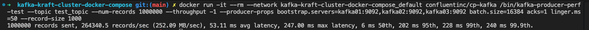
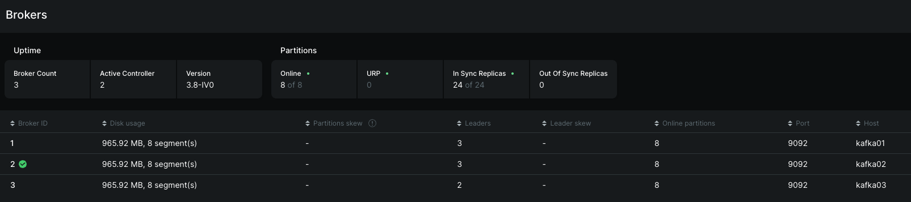
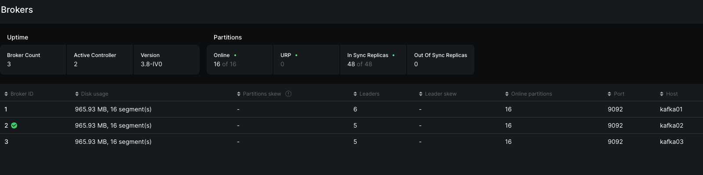
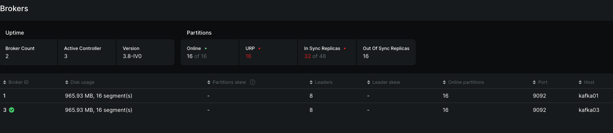
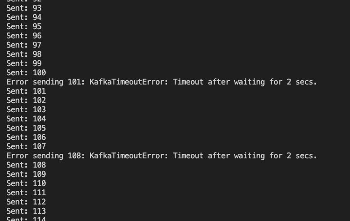
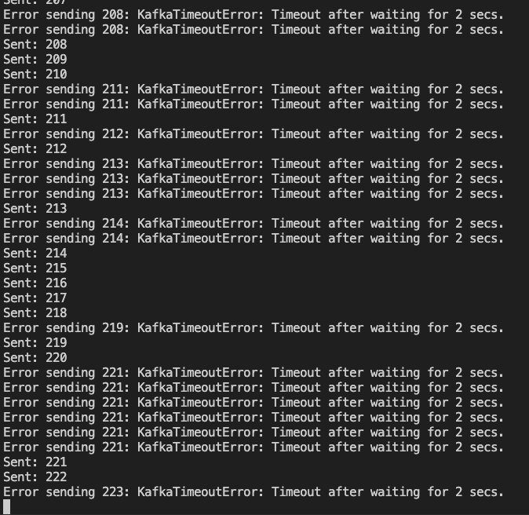
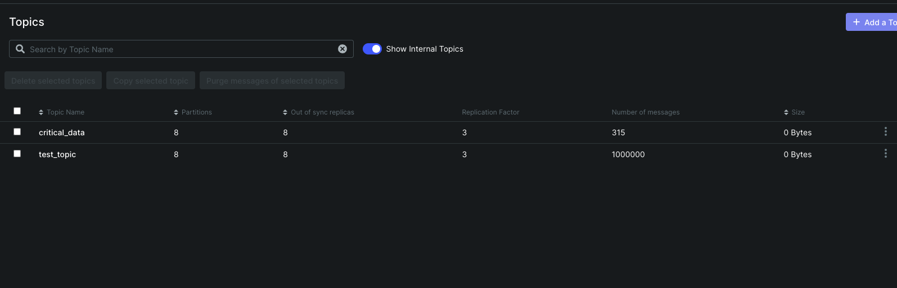
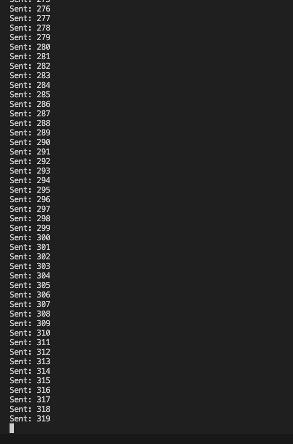
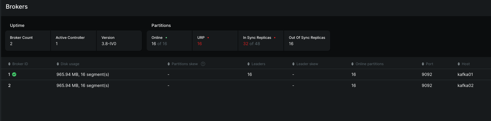

# HW 2 Solution

## ШАГ 3. В отчете отразите основные характеристики топика и зачем они нужны. Например, почему здесь столько партиций? А что если их не будет? Насколько отказоустойчивый наш топик?

### Основные характеристики топика и зачем они нужны

1. Количество партиций: 8

Партиции позволяют обрабатывать данные параллельно. Чем больше партиций — тем выше потенциальная пропускная способность топика (больше продюсеров и консъюмеров могут работать одновременно).

- Почему здесь 8 партиций?

Вероятно, система должна выдерживать высокую нагрузку или требуется горизонтальное масштабирование консюмеров.

- Что если партиций не будет (например, всего 1)?

Производительность резко упадёт: все сообщения будут обрабатываться последовательно. Нельзя будет масштабировать консюмеров: только один может читать топик одновременно. Возможны задержки и рост lag при пиковых нагрузках.

2. Replication Factor: 3

Каждая партиция хранится на трёх брокерах. Это обеспечивает устойчивость к сбоям узлов.

- Зачем нужен replication factor?

Чтобы при падении брокера данные не потерялись и чтение/запись продолжались.

3. In Sync Replicas (ISR): 24 of 24

Каждая реплика партиции «в синхроне» с лидером, то есть все брокеры корректно реплицируют данные.

- Почему это важно?

Это показатель здоровья кластера: если какие-то реплики выпадут, уменьшается отказоустойчивость.

4. Clean Up Policy: DELETE

Kafka автоматически удаляет старые сегменты после достижения заданных ограничений (время, размер).

- Зачем это нужно?

Чтобы топик не рос бесконечно и не занимал весь диск.

5. Segment Size: 3 GB / Segment Count: 24

Данные хранятся в сегментах фиксированного размера.

- Зачем сегменты?

Быстрее удалять старые данные (удаляется целый сегмент, не отдельные записи). Удобнее работать с файлами на диске

- Насколько отказоустойчивый наш топик?

Топик очень отказоустойчив, потому что: Replication Factor = 3 — выдерживает отказ до 2 брокеров при условии, что лидер остаётся доступным. ISR полностью заполнен (24/24) — все реплики актуальны, нет отставаний. Kafka может автоматически выбрать нового лидера партиции при сбое. То есть топик продолжит работать даже при падении нескольких узлов, и вероятность потери данных минимальна (при acks=all у продюсера).

## ШАГ 4. Сделайте скриншот результатов из терминала, сделайте скриншот Kafka UI, что события дошли. Объясните, что к чему в результатах. Сколько RPS? Сколько Latency? На всех ли брокерах есть события?

1. RPS (Records Per Second). По выводу kafka-producer-perf-test: 1000000 records sent, 264340.5 records/sec (252.09 MB/sec). RPS ≈ 264 340 сообщений/сек

2. Latency (задержка). 

Average latency: 53.11 ms

Max latency: 247 ms

50th percentile (median): 6 ms

95th percentile: 202 ms

99th percentile: 228 ms

99.9th percentile: 240 ms

Краткое объяснение: Медиана = 6 ms — половина сообщений отправляются очень быстро. Средняя = 53 ms — растёт из-за больших batch’ей (linger.ms=50). Хвосты (95–99.9%) — типично выше, т.к. попадают сообщения, ждущие формирования батча.

То есть задержки предсказуемые и объясняются конфигурацией продюсера.

3. На всех ли брокерах есть события? Да. В UI видно - у каждого брокера: Disk usage ≈ 965.92 MB, 8 segments. У топика: 8 партиций, replication factor = 3, 1 000 000 сообщений, 3 GB общий размер. Так как RF=3 и нет Out of Sync реплик (0), то: все 8 партиций реплицированы на всех 3 брокерах и значит, события лежат на каждом брокере

## ШАГ 5

Имеем лидера kafka02

Делаем stop для kafka02, теперь лидером становится kafka03

Сообщения продолжают идти, правда были некоторые таймауты

После того как убили лидера kafka03, то kafka ui поплохело

Число таймаутов сразу увеличилось, хотя некоторые события все-же пропихивались. Что такое ISR? ISR (In-Sync Replicas) — это набор реплик партиции, которые полностью синхронизированы с лидером и содержат все записанные данные.

Вернули kafka02, kafka ui ожило

Сообщения теперь идут без таймаутов

Мы ожили после того как восстановили kafka02

Соответственно после восстановления kafka03, ожил весь кластер и вернулся в валидное состояние
